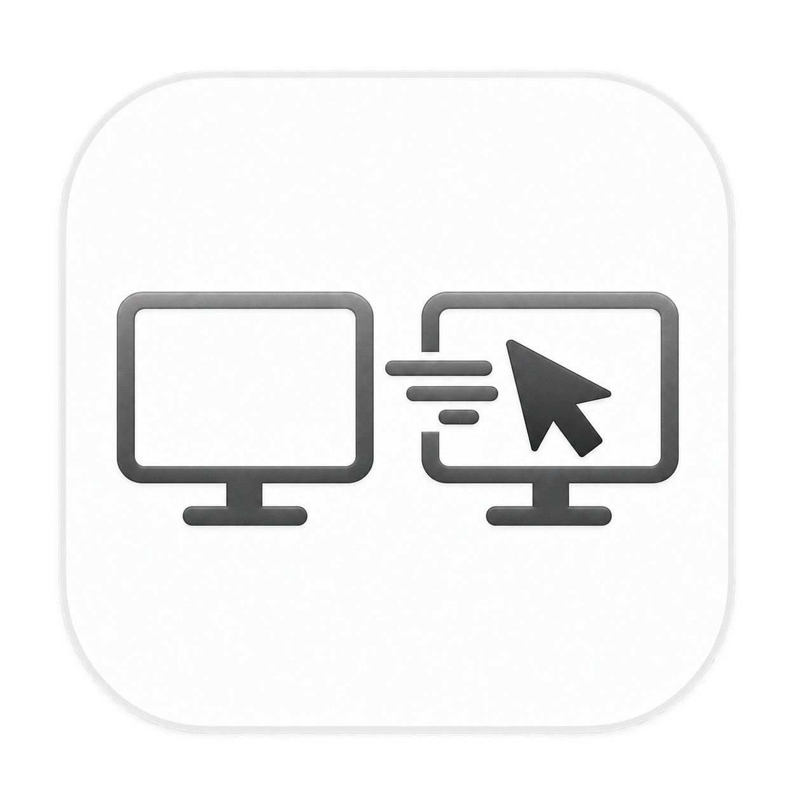
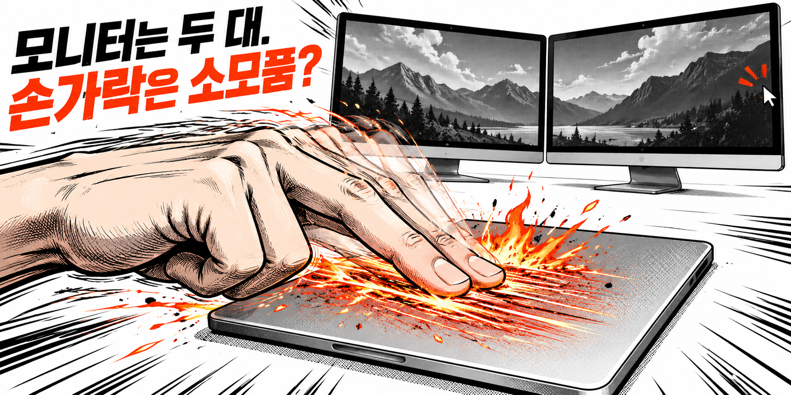

# Mouse Teleportation

  

**모니터 건너갈 때마다 트랙패드를 한참 긁지 마세요. Option + Tab 한 번이면 됩니다.**

마우스가 있는 화면을 제외한 다음 디스플레이의 정중앙으로 포인터를 옮깁니다. 도착한 실제 시스템 커서가 잠깐 커졌다가 원래 크기로 돌아갑니다.

도착 화면을 **macOS의 활성 디스플레이로 전환**하여, 한 번 더 클릭하지 않아도 그쪽 메뉴 막대가 선명해집니다. 주 디스플레이 설정은 바꾸지 않습니다. macOS의 기본 동작에 따라 그 화면에서 사용하던 앱이 앞으로 올 수 있습니다.

도착 화면의 가장자리에 **약 0.24초 동안 옅은 푸른빛이 넓게 번졌다 사라지는 효과**를 표시합니다. 화면 가운데는 투명하며 효과 패널은 클릭이나 키보드 포커스를 받지 않습니다.

- 메뉴바·Dock·Command + Tab에 표시되지 않습니다.
- 일반 창 없이 백그라운드에서 동작합니다.
- 최초 실행 때 로그인 자동 시작을 등록합니다.
- 네트워크 통신, 광고, 계정, 사용 기록 수집이 없습니다.

[다운로드](https://github.com/jeonghyeon-net/mouse-teleportation/releases/latest) · [사용 안내](docs/user-guide.md) · [개발 안내](CONTRIBUTING.md)

## 시작하기

macOS 14 이상, Apple Silicon Mac용입니다.

1. [최신 릴리스](https://github.com/jeonghyeon-net/mouse-teleportation/releases/latest)의 **Assets**에서 `.dmg`를 받습니다.
2. DMG를 열고 **Mouse Teleportation**을 **Applications(응용 프로그램)** 폴더로 드래그합니다.
3. 응용 프로그램 폴더에서 앱을 한 번 실행합니다.
4. **Option + Tab**을 누릅니다.

앱을 실행해도 창이나 메뉴바 아이콘이 나오지 않는 것이 정상입니다. 자동 시작 여부는 **시스템 설정 → 일반 → 로그인 항목 및 확장 프로그램**에서 확인할 수 있습니다.

현재 배포는 ad-hoc 서명이며 Apple 공증은 없습니다. 다운로드한 앱을 macOS가 차단하면 출처를 확인한 뒤 **시스템 설정 → 개인정보 보호 및 보안 → 확인 없이 열기**를 사용하세요. Gatekeeper를 시스템 전체에서 끌 필요는 없습니다.

## 동작

화면이 두 대면 서로 왕복합니다. 세 대 이상이면 macOS 화면 배치의 **왼쪽부터 오른쪽**, 같은 x 위치에서는 **위에서 아래** 순서로 순환합니다. 현재 화면은 활성 창이 아니라 **마우스 위치**로 판단합니다.

화면이 한 대거나 화면 미러링만 사용 중이면 이동하지 않습니다. 마우스 버튼을 누른 드래그 중에도 이동하지 않습니다. 키를 누르고 있을 때는 한 번만 이동하고, Tab을 뗐다 다시 누르면 다음 화면으로 갑니다.

확대에는 macOS의 실제 커서를 제어하는 비공개 SkyLight API를 사용합니다. 별도 커서를 그리는 방식은 아니지만, **macOS의 흔들기 제스처 자체를 실행하는 것은 아닙니다.** 약 0.8초 동안 확대했다가 복원하며 시스템 포인터 크기 설정을 영구 변경하지 않습니다. OS 업데이트로 비공개 API가 바뀌면 확대 효과가 동작하지 않을 수 있습니다.

활성 디스플레이 전환도 SkyLight 비공개 API를 사용하며 macOS 업데이트에 영향을 받을 수 있습니다. 전환 API를 사용할 수 없으면 커서 이동과 도착 효과만 유지합니다. 마우스 클릭을 합성하거나 접근성 API로 개별 창을 선택하지 않습니다.

## 만든 이유

화면을 넓게 쓰려고 모니터를 붙였더니, 이번에는 마우스가 출퇴근을 합니다. 오른쪽 모니터 한 번 보려면 트랙패드를 긁고, 다시 왼쪽으로 오려면 또 긁습니다. 화면은 넓어졌는데 손가락만 더 바빠졌습니다.

필요한 건 거창한 관리 화면이 아니라 다른 모니터로 바로 가는 단축키 하나였습니다. 그래서 메뉴바 자리도, Dock 자리도 차지하지 않는 작은 앱으로 만들었습니다.

## 개발과 배포

Swift·AppKit으로 구현했으며 외부 런타임 의존성이 없습니다. GitHub Actions는 사용하지 않고 로컬 Mac에서 빌드·검증·릴리스합니다.

- [기여와 빌드](CONTRIBUTING.md)
- [로컬 릴리스](docs/releasing.md)
- [구조와 제약](docs/architecture.md)
- [검증 기록](docs/verification.md)
- [변경 기록](CHANGELOG.md) · [보안 제보](SECURITY.md)

[Menu Bar Dock](https://github.com/jeonghyeon-net/menubar-dock)의 문서와 로컬 배포 구성을 참고했습니다. [MIT 라이선스](LICENSE)로 배포합니다.
